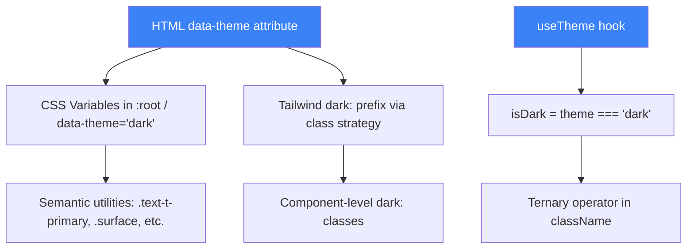

# Дизайн-документ: Исправление светлой темы GastroMap

## Обзор

Данный документ описывает техническое решение для исправления светлой темы во всём приложении GastroMap. Основная проблема — множество компонентов используют жёстко закодированные цвета тёмного режима (bg-white/5, text-white/40, border-white/10), которые становятся невидимыми на светлом фоне. Решение заключается в систематическом применении существующей инфраструктуры тем (isDark паттерн, CSS-переменные, Tailwind dark: префикс) ко всем затронутым компонентам.

## Архитектура

### Существующая инфраструктура тем

Приложение уже имеет полноценную систему тем:



### Стратегия исправления

Три уровня исправлений (от инфраструктуры к компонентам):

1. **Уровень конфигурации** — tailwind.config.js surface цвета → CSS-переменные
2. **Уровень компонентов** — замена hardcoded dark стилей на isDark тернарные выражения
3. **Уровень страницы** — LandingPageV3 полная адаптация к теме

## Компоненты и интерфейсы

### 1. tailwind.config.js — Surface Colors

**Проблема:** Цвета `surface` жёстко закодированы как тёмные значения:
```js
surface: {
    DEFAULT: 'hsl(220 20% 6%)',      // ← всегда тёмный
    elevated: 'hsl(220 20% 9%)',     // ← всегда тёмный
    foreground: 'hsl(220 20% 96%)'   // ← всегда светлый текст
}
```

**Решение:** Заменить на CSS-переменные, определённые в index.css:

```js
surface: {
    DEFAULT: 'hsl(var(--surface))',
    elevated: 'hsl(var(--surface-elevated))',
    foreground: 'hsl(var(--surface-foreground))'
}
```

Новые CSS-переменные в index.css:
```css
:root {
    --surface: 0 0% 100%;           /* white */
    --surface-elevated: 0 0% 98%;   /* near-white */
    --surface-foreground: 240 10% 3.9%; /* near-black text */
}

[data-theme='dark'] {
    --surface: 220 20% 6%;          /* existing dark value */
    --surface-elevated: 220 20% 9%; /* existing dark value */
    --surface-foreground: 220 20% 96%; /* existing light text */
}
```

### 2. Паттерн исправления компонентов

Для каждого компонента с hardcoded dark стилями применяется единый паттерн:

**До (проблема):**
```jsx
className={`... ${isSelected ? 'bg-indigo-500 text-white' : 'bg-white/5 text-white/40 border-white/10'}`}
```

**После (исправление):**
```jsx
className={`... ${isSelected 
    ? 'bg-indigo-500 text-white border-indigo-400' 
    : isDark 
        ? 'bg-white/5 text-white/40 border-white/10 hover:border-white/20' 
        : 'bg-gray-100 text-gray-600 border-gray-200 hover:border-gray-300'
}`}
```

### 3. Карта затронутых компонентов

| Компонент | Проблемные элементы | Подход |
|-----------|-------------------|--------|
| ProfileEditPage | Vibe, Dietary, Price, Features чипы (inactive state) | isDark тернарный |
| SecurityPrivacyPage | Уже исправлен (использует isDark) | Проверить badge "Soon" |
| SavedPage | Карточки, текст | isDark тернарный |
| DashboardPageV2 | Множественные элементы | isDark тернарный |
| LeaderboardPage | Границы, фоны | isDark тернарный |
| HelpCenterPage | Кнопки, текст | isDark тернарный |
| DeleteDataPage | Карточки, кнопки | isDark тернарный |
| LanguageSettingsPage | Элементы списка | isDark тернарный |
| ProfilePage | Статистика, теги | isDark тернарный |
| FilterModal | Чипы фильтров, кнопки | isDark тернарный |
| SmartSearchBar | Placeholder, фон | isDark тернарный |
| LocationsPage | Карточки, текст, границы | isDark тернарный |
| LandingPageV3 | Вся страница (bg-[#0A0A0A]) | isDark + semantic colors |
| MainLayout | AI chat button (bg-white/10) | isDark тернарный |

### 4. LandingPageV3 — Специальный случай

LandingPageV3 полностью жёстко закодирована с тёмным фоном (`bg-[#0A0A0A]`). Два варианта:

**Выбранный подход:** Сделать страницу theme-aware с isDark паттерном.

- Корневой контейнер: `isDark ? 'bg-[#0A0A0A] text-white' : 'bg-white text-gray-900'`
- Секции: заменить `bg-[#0A0A0A]` на `isDark ? 'bg-[#0A0A0A]' : 'bg-white'` или `bg-background`
- Текст: `text-white` → `isDark ? 'text-white' : 'text-gray-900'`
- Субтекст: `text-white/30`, `text-white/40` → `isDark ? 'text-white/40' : 'text-gray-500'`
- Границы: `border-white/5` → `isDark ? 'border-white/5' : 'border-gray-200'`
- Navbar: уже имеет `bg-black/80` при скролле → добавить light вариант

### 5. Цветовая палитра для light-mode inactive элементов

Для обеспечения WCAG AA контрастности, стандартные замены:

| Dark-mode класс | Light-mode замена | Контраст |
|----------------|-------------------|----------|
| `bg-white/5` | `bg-gray-100` или `bg-slate-100` | — |
| `text-white/40` | `text-gray-600` или `text-slate-600` | ~7:1 на белом |
| `border-white/10` | `border-gray-200` или `border-slate-200` | ~3.5:1 |
| `hover:border-white/20` | `hover:border-gray-300` | ~4:1 |
| `bg-white/10` | `bg-gray-100` или `bg-blue-50` | — |
| `text-white/60` | `text-gray-500` | ~5:1 на белом |

## Модели данных

Изменений в моделях данных не требуется. Все исправления касаются только CSS-классов и конфигурации Tailwind.

## Обработка ошибок

- При отсутствии CSS-переменной `--surface` в браузере, Tailwind fallback через `hsl(var(--surface))` отобразит чёрный цвет — это приемлемо, так как переменные определены в index.css, который загружается всегда
- Компоненты, использующие `useTheme()`, получат `'light'` по умолчанию если `data-theme` не установлен — это корректное поведение

## Стратегия тестирования

### Почему Property-Based Testing НЕ применим

Данная задача — исправление UI-рендеринга и CSS-конфигурации. Она не подходит для PBT потому что:
- Цвета фиксированы в конфигурации, не зависят от пользовательского ввода
- Тестируется визуальное отображение, а не логика с вариативным входом
- Два состояния (light/dark) — конечное множество, не бесконечное пространство входов

### Подход к тестированию

1. **Visual Regression Tests** — скриншоты компонентов в обеих темах (Playwright/Storybook)
2. **Unit Tests (example-based)** — проверка что компоненты применяют правильные CSS-классы в зависимости от темы
3. **Accessibility Audit** — axe-core для проверки контрастности в light mode
4. **Manual QA** — визуальная проверка всех затронутых страниц в обеих темах

### Конкретные тесты

- Для каждого исправленного компонента: рендер с `theme='light'`, проверка отсутствия классов `bg-white/5`, `text-white/40`, `border-white/10` без isDark условия
- Для tailwind.config.js: проверка что surface цвета используют `var(--surface)` синтаксис
- Для LandingPageV3: рендер в обеих темах, проверка корневого фона
- Accessibility: запуск axe-core на каждой странице в light mode, проверка 0 contrast violations

### Порядок исправления (рекомендуемый)

1. tailwind.config.js + index.css (инфраструктура)
2. ProfileEditPage (наиболее критичный, много чипов)
3. FilterModal + SmartSearchBar (часто используемые)
4. Остальные dashboard страницы (по алфавиту)
5. LocationsPage
6. LandingPageV3 (самый объёмный)
7. MainLayout AI button
8. Финальный accessibility audit
